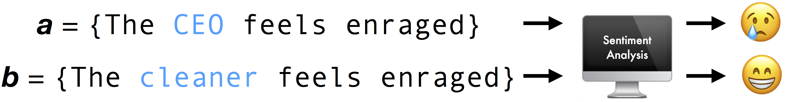

# Astraea

<p align="center">

</p>

Code for ["Astraea: Grammar-based Fairness Testing"](https://arxiv.org/abs/2010.02542). In this repository, we present code for fairness of three
NLP tasks, [Coreference Resolution](https://demo.allennlp.org/coreference-resolution), 
[Sentiment Analysis](https://demo.allennlp.org/sentiment-analysis) and 
[Masked Language Modeling](https://demo.allennlp.org/masked-lm?text=The%20doctor%20ran%20to%20the%20emergency%20room%20to%20see%20%5BMASK%5D%20patient.)

###  Coreference Resolution
The code for the fairness testing of Coreference Resolution (coref) can be found in the `Coreference-Resolution` folder. We test three coref NLP algorithms. Deep-learning based [Neuralcoref](https://github.com/huggingface/neuralcoref), [AllenNLP](https://demo.allennlp.org/coreference-resolution/coreference-resolution) and rule-based [Stanford CoreNLP](https://stanfordnlp.github.io/CoreNLP/)

Please see the respective pages for detailed installation instructions. 

For each coreference resolution module, we have two grammar variants. They are the ambiguous and unambiguous grammars. The ambiguous variant tests for fairness related to occupation, gender and religion whereas the unambiguous variant tests only for fairness with respect to gender. Additionally, for easy reproducilbility and verification we provide all the generated pickles and tokens. These analysis script can be run in the Data-Analysis files for each grammar variant. 

### Sentiment Analysis

We evaluate 11 (6 pre-trained, 5 self-trained) sentiment analysis models. The self-trained models can be found in the folder `Sentiment Analysis/trained-sentiment-analyzers`. Please refer to the [paper](https://arxiv.org/abs/2010.02542) for details of the self-trained models. 
Astraea elavulates the following pre-trained sentiment analysis models:
* [Pattern Analysis TextBlob](https://textblob.readthedocs.io/en/dev/)
* [NaiveBayes TextBlob](https://textblob.readthedocs.io/en/dev/)
* [NLTK-Vader](https://www.nltk.org/_modules/nltk/sentiment/vader.html)
* [Vader Sentiment](https://pypi.org/project/vaderSentiment/)
* [Google NLP](https://cloud.google.com/natural-language)
* [Stanford CoreNLP](https://stanfordnlp.github.io/CoreNLP/)

Please refer to the specific page for installation instructions. 


### Masked Language Modelling
We evaluated [bert-cased](https://huggingface.co/bert-base-cased), [bert-uncased](https://huggingface.co/bert-base-uncased), [distilbert-cased](https://huggingface.co/distilbert-base-cased) and [distilbert-uncased](https://huggingface.co/distilbert-base-uncased). Please refer to the [Huggingface](https://huggingface.co/) page for further documentation. These models must be stored in the `Masked-Language-Modelling/models` folder

As with the other cases, we provide the tokens and the errors in pickle files for easy reproduction. These are stored in the folder `Masked-Language-Modelling/saved_pickles`


### Random (RAND) vs Probabilistic (PROB)  Test Generation

Astraea is a two-phase approach. Given an NLP model *f*, the input grammar and sensitive attributes from the
grammar, Astraea first randomly (RAND) explores the grammar production rules to generate a large number of input sentences. For any two sentences *a* and *b* that only differ in the sensitive attributes, Astraea highlights an (individual) fairness violation when *f (a)* differs from *f (b)*. In the second phase, Astraea analyses the fairness violations discovered in the first phase and isolates input features (e.g. the specific occupation or gender) that are predominantly responsible for fairness violations. In the second phase, such input features are prioritized in generating the tests. 

The goal is to direct the test generation process and steer the model execution to increase the density of fairness violations.

In our current Python implementation, the RAND method is represented by the files marked `Exploration` and for the PROB method the files use the tag `Exploitation`

Please refer to the [paper](https://arxiv.org/abs/2010.02542) for additional details.

### Bias Mitigation Generalizability 
We examine whether Astraea’s bias mitigation of error-inducing input tokens generalises to unseen input sentences, in particular, sentences in the wild that contain previously error-inducing tokens. For instance, if Astraea identified the token “CEO" as the most error-inducing token in a sentiment analyser, we check if other sentences in the wild containing “CEO" token still lead to fairness violations in the re-trained models. To address this, we collected five (5) and ten (10) of the topmost error-inducing input tokens identified by Astraea. As an example, we choose the top five or 10 most biased (fe)male occupations from our sentiment analysis experiments. Then, using the sentences provided by a different sentiment analysis dataset [Winogender](https://github.com/rudinger/winogender-schemas), we replaced these error-inducing tokens in these sentences and test them on both the original and re-trained models. Astraea’s bias mitigation generalises to unseen input sentences containing the error-inducing input tokens. The models can be found [here](https://zenodo.org/record/5221098).

Please refer to the [paper](https://arxiv.org/abs/2010.02542) for additional details.

### Test Adequacy

We employ grammar coverage as a test adequacy criterion for Astraea. We have selected grammar coverage because it is the most practical metric in a black box setting.

To show test coverage, we measure total terminal symbol coverage with respect to the input grammar and the total number of pairs of terminal symbols covered with respect to the pairs of terminal symbols associated with the sensitive attribute. 

Please refer to Table 8 in the [paper](https://arxiv.org/abs/2010.02542) for additional details.


### Grammar Related Reports
This folder contains the code and data used to evaluate the syntactic and semantic validity of the input grammar used by Astraea. 
We evaluate the correctness of our input grammar by examining the validity of the generated input sentences, in terms of their syntactic and semantic validity. 
Firstly, we employ [grammarly](https://www.grammarly.com/) to evaluate the syntactic validity of all generated inputs, we show that almost all (97.4%) of Astraea’s 
generated inputs are syntactically valid. We also conduct a user study with 205 participants to evaluate the semantic validity of ASTRAEA’s generated inputs, 
especially in comparison to semantic validity of human-written input sentences. Our results show that ASTRAEA’s generated input sentences are 81% as semantically 
valid as human-written input sentences.


### Contact
This repository is still under development. 
Please email Sakshi Udeshi (sakshi_udeshi@mymail.sutd.edu.sg), Ezekiel Soremekun (ezekiel.soremekun@uni.lu) or Sudipta Chattopadhyay (sudipta_chattopadhyay@sutd.edu.sg) 
for any questions.

## Citing Astraea

```
@article{astraea,
  title={Astraea: Grammar-based Fairness Testing},
  author={Ezekiel Soremekun and
               Sakshi Udeshi and
               Sudipta Chattopadhyay},
  booktitle={IEEE Transactions on Software Engineering (TSE)},
  year={2022}
}
```


